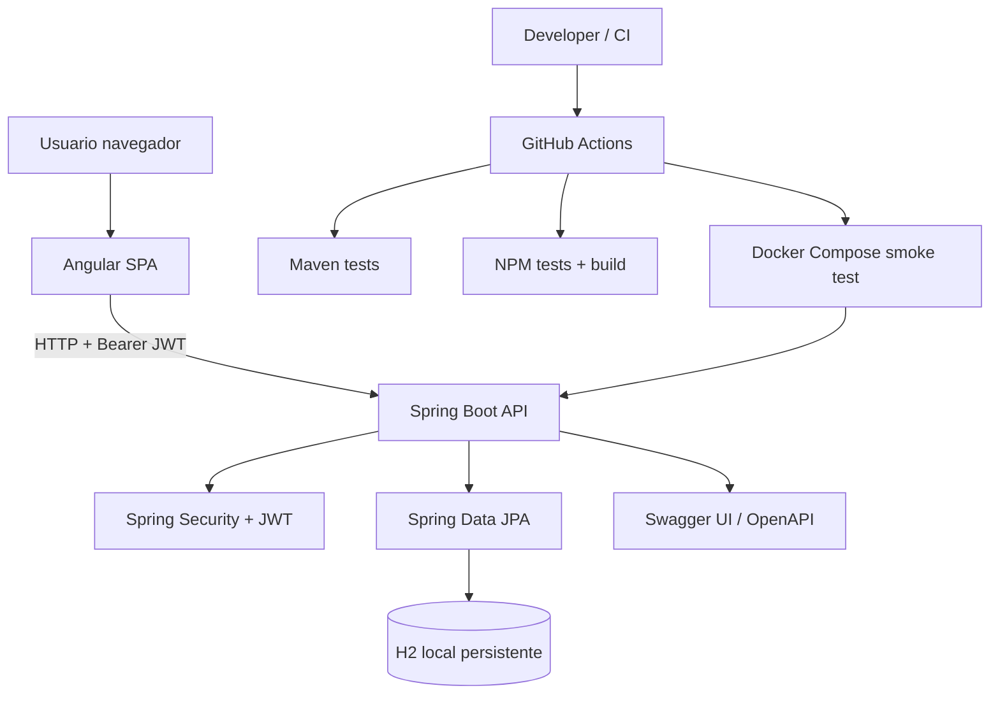
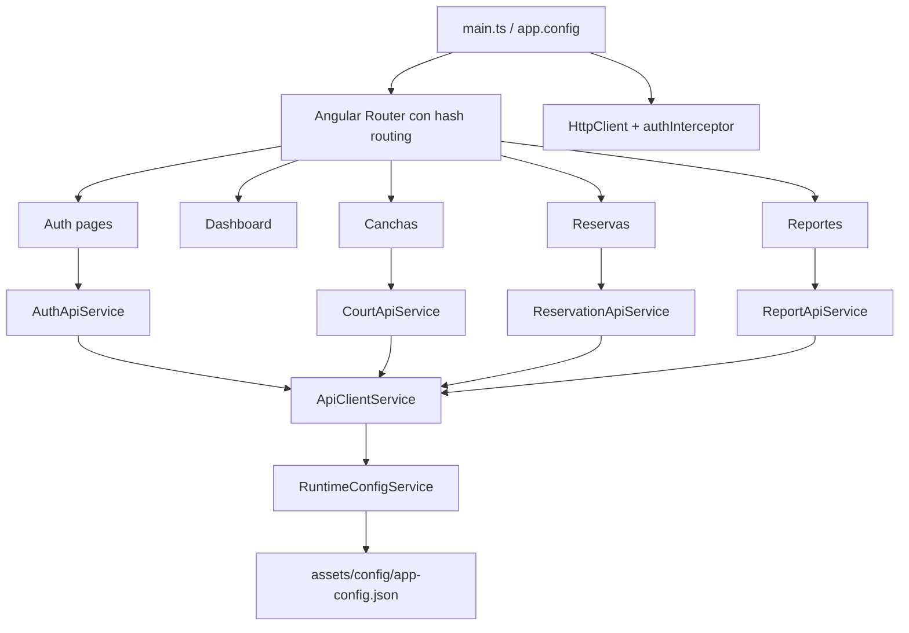
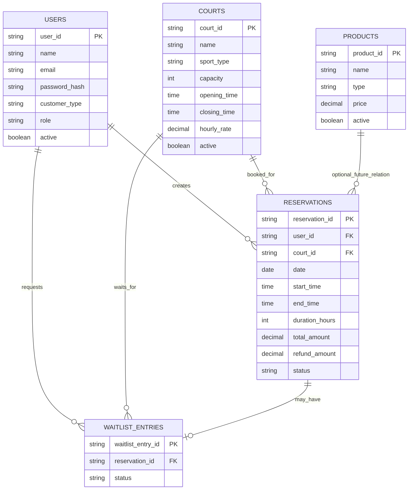
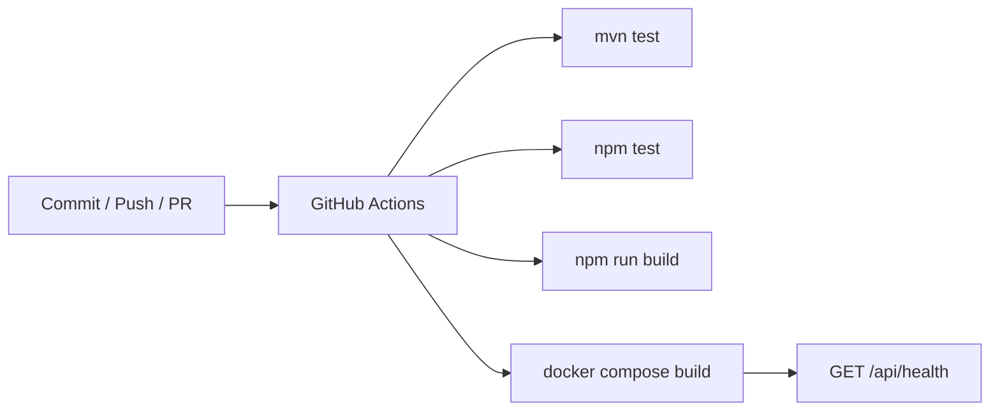
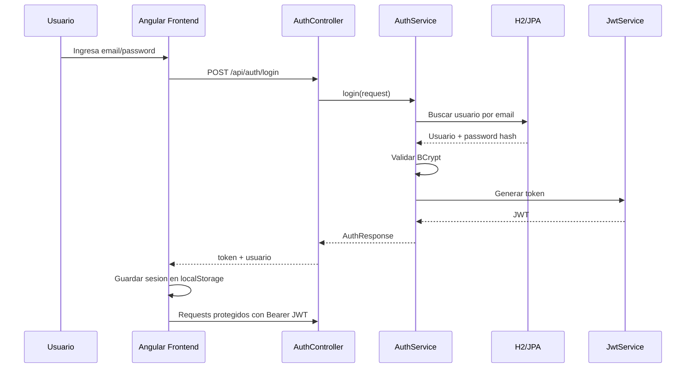
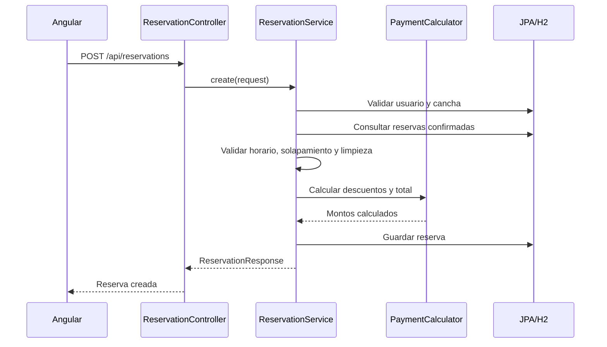

# Arquitectura Tecnica - Deportal

## 1. Vision General

Deportal es una aplicacion fullstack para administrar canchas deportivas, reservas, cancelaciones, reembolsos, waitlist y reportes de utilizacion. La solucion esta dividida en dos repositorios independientes: frontend Angular y backend Spring Boot.

El frontend consume una API REST protegida con JWT. El backend persiste datos en H2 para ejecucion local/demo y queda preparado para migrar a PostgreSQL/RDS en un entorno productivo.



> Nota: no hay balanceador ni servicios externos activos en la version local. Para produccion se recomienda usar CloudFront/S3 para frontend, ECS/EC2 para backend y RDS PostgreSQL para base de datos.

## 2. Estructura del Proyecto

Repositorios separados:

```txt
deportal-frontend/
├── public/assets/config/       # Configuracion runtime del frontend
├── src/app/core/               # Auth, API client, config y modelos
├── src/app/features/           # Pantallas por modulo funcional
├── .github/workflows/          # CI frontend
├── docs/                       # Documentacion del proyecto
└── package.json                # Scripts y dependencias Angular

deportal-backend/
├── src/main/java/com/deportal/ # Codigo fuente Spring Boot
├── src/test/java/com/deportal/ # Pruebas JUnit/Mockito
├── src/main/resources/         # application.yml
├── .github/workflows/          # CI backend
├── Dockerfile                  # Imagen backend
├── docker-compose.yml          # Ejecucion local backend + H2 persistente
└── pom.xml                     # Dependencias Maven
```

Modulos backend principales:

```txt
auth/           # Registro, login, usuario autenticado
security/       # JWT, filtro de autenticacion, SecurityConfig
users/          # Usuarios, roles y tipo de cliente
courts/         # Canchas deportivas
reservations/   # Reservas, cancelacion, disponibilidad
waitlist/       # Lista de espera
payments/       # Calculo de pagos y descuentos
reports/        # Reporte de utilizacion
shared/         # Errores, excepciones, sanitizacion
config/         # OpenAPI, datos iniciales, clock
```

## 3. Stack Tecnologico Detallado

### 3.1 Backend

| Elemento | Version | Uso |
|---|---:|---|
| Java | 21 | Lenguaje backend LTS |
| Spring Boot | 3.5.8 | Framework principal |
| Spring Web MVC | Gestionado por Spring Boot | API REST sincronica |
| Spring Security | Gestionado por Spring Boot | Proteccion de endpoints |
| Spring Data JPA | Gestionado por Spring Boot | Persistencia relacional |
| H2 | Gestionado por Spring Boot | Base local/demo |
| springdoc-openapi | 2.8.14 | Swagger UI / OpenAPI |
| JJWT | 0.12.6 | Generacion y validacion JWT |
| JUnit 5 / Mockito | Gestionado por Spring Boot | Pruebas unitarias |
| Maven | 3.x | Gestion de dependencias y build |
| Docker Compose | 2.x | Ejecucion local del backend |

### 3.2 Frontend

| Elemento | Version | Uso |
|---|---:|---|
| Angular | 22.0.x | SPA frontend |
| Angular Router | 22.0.x | Navegacion hash routing |
| Angular Forms | 22.0.x | Formularios login, registro, canchas, reservas, reportes |
| Angular HttpClient | 22.0.x | Consumo de API REST |
| RxJS | 7.8.x | Programacion reactiva HTTP |
| TypeScript | 6.0.x | Lenguaje frontend |
| Vitest | 4.0.x | Pruebas unitarias frontend |
| npm | 10.x | Gestion de paquetes |

Arquitectura frontend:



## 4. Modelo de Datos / Base de Datos

La base actual es relacional con JPA/H2. Entidades principales:



No hay multi-tenancy en la version actual.

## 5. Seguridad

| Area | Implementacion actual | Recomendacion futura |
|---|---|---|
| Autenticacion | JWT Bearer sin cookies | Rotacion de refresh tokens si se requiere sesion prolongada |
| Passwords | BCrypt | Politica formal de complejidad y bloqueo por intentos |
| Autorizacion | Roles `ADMIN` y `USER` disponibles | Endurecer permisos por rol en endpoints administrativos |
| CSRF | Deshabilitado por uso stateless sin cookies | Mantener sin cookies o habilitar si cambia estrategia |
| SQL Injection | JPA repositorios parametrizados | Mantener queries parametrizadas |
| XSS | Angular escaping por defecto | Agregar CSP en despliegue productivo |
| Secretos | Variables de entorno con default local | Usar GitHub Secrets / AWS Secrets Manager en produccion |

## 6. Infraestructura y Despliegue

Entornos previstos:

| Entorno | Frontend | Backend | Base de datos |
|---|---|---|---|
| Local | `npm start` | Docker Compose o `mvn spring-boot:run` | H2 archivo |
| CI | GitHub Actions | GitHub Actions + Docker smoke test | H2 efimera |
| Produccion sugerida | S3 + CloudFront | ECS/EC2 | RDS PostgreSQL |

Pipeline CI/CD:



## 7. Integraciones Externas

No existen integraciones externas obligatorias en la version actual. Swagger UI y H2 Console son herramientas internas de desarrollo. Futuras integraciones posibles:

| Integracion | Proposito | Estado |
|---|---|---|
| AWS S3/CloudFront | Hosting estatico frontend | Pendiente |
| AWS RDS PostgreSQL | Base productiva | Pendiente |
| AWS Secrets Manager | Gestion de secretos | Pendiente |
| CloudWatch / OpenTelemetry | Observabilidad | Pendiente |

## 8. Flujos Criticos

Flujo de login:



Flujo de reserva:


