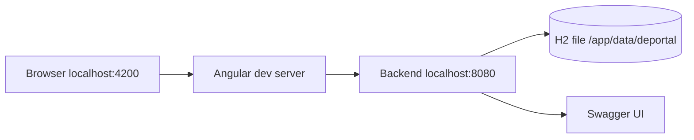
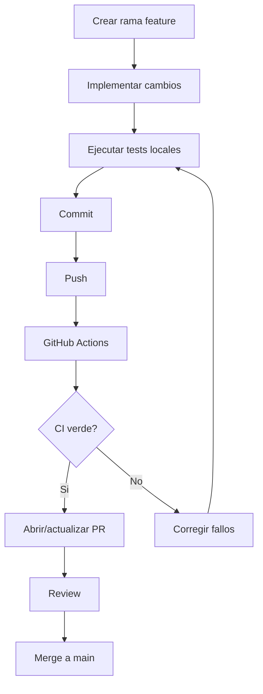

# Guia del Desarrollador - Deportal

## 1. Requisitos Previos

| Herramienta | Version minima | Proposito |
|---|---:|---|
| Git | 2.x | Control de versiones |
| Java | 21 | Ejecutar backend Spring Boot |
| Maven | 3.9.x | Build y tests backend |
| Docker | 24.x | Contenedor backend |
| Docker Compose | 2.x | Orquestacion local backend |
| Node.js | 22.22.3 | Ejecutar Angular 22 |
| npm | 10.x | Gestion de paquetes frontend |

Archivos de configuracion relevantes:

| Archivo | Repositorio | Descripcion |
|---|---|---|
| `docker-compose.yml` | Backend | Define backend Docker y H2 persistente |
| `src/main/resources/application.yml` | Backend | Configuracion Spring local |
| `public/assets/config/app-config.json` | Frontend | URL runtime del backend |
| `.github/workflows/*.yml` | Ambos | GitHub Actions CI |

> No subir credenciales reales al repositorio. Los secretos productivos deben ir en variables de entorno o GitHub Secrets.

## 2. Configuracion del Entorno Local

### 2.1 Clonar repositorios

```bash
git clone <BACKEND_REPOSITORY_URL> deportal-backend
git clone <FRONTEND_REPOSITORY_URL> deportal-frontend
```

### 2.2 Levantar backend con Docker

```bash
cd deportal-backend
docker compose up --build -d
```

Validar backend:

```bash
curl -f http://localhost:8080/api/health
```

URLs backend:

| URL | Uso |
|---|---|
| `http://localhost:8080/api/health` | Health check |
| `http://localhost:8080/swagger-ui.html` | Swagger UI |
| `http://localhost:8080/h2-console` | Consola H2 |

### 2.3 Instalar y ejecutar frontend

```bash
cd deportal-frontend
npm ci
npm start
```

Abrir:

```txt
http://localhost:4200
```

### 2.4 Credenciales iniciales

Si el backend usa el seed inicial:

| Campo | Valor |
|---|---|
| Email | `admin@deportal.local` |
| Password | `Deportal123` |

## 3. Estructura de Servicios



| Servicio | Puerto | Comando |
|---|---:|---|
| Frontend Angular | 4200 | `npm start` |
| Backend Spring Boot | 8080 | `docker compose up --build -d` |
| H2 Console | 8080 | `/h2-console` |

## 4. Comandos Utiles

Backend:

| Descripcion | Comando |
|---|---|
| Ejecutar tests | `mvn test` |
| Levantar Docker | `docker compose up --build -d` |
| Ver logs | `docker compose logs -f backend` |
| Validar compose | `docker compose config` |
| Apagar contenedor | `docker compose down` |
| Borrar volumen H2 | `docker compose down -v` |

Frontend:

| Descripcion | Comando |
|---|---|
| Instalar dependencias | `npm ci` |
| Servidor local | `npm start` |
| Tests una vez | `npm test -- --watch=false` |
| Build produccion | `npm run build` |

## 5. Flujo de Trabajo Git

Estrategia recomendada:

- `main`: rama estable.
- `feature/<descripcion>`: nuevas funcionalidades.
- `fix/<descripcion>`: correcciones.
- Pull Request hacia `main` con CI en verde.



## 6. CI/CD

Cada repositorio tiene su propio workflow.

Backend:

- Trigger: `push` y `pull_request`.
- Valida `mvn test`.
- Valida Docker Compose.
- Construye imagen Docker.
- Levanta backend y prueba `/api/health`.

Frontend:

- Trigger: `push` y `pull_request`.
- Ejecuta `npm ci`.
- Ejecuta pruebas.
- Ejecuta build.

No hay despliegue automatico productivo configurado. La recomendacion futura es separar pipelines por entorno.

## 7. Troubleshooting

| Problema | Causa probable | Solucion |
|---|---|---|
| Angular rechaza Node | Version Node menor a la requerida | Usar Node 22.22.3 o superior |
| Login falla con usuario inicial | H2 tiene datos antiguos | `docker compose down -v` y levantar de nuevo |
| CORS en frontend | Origen no permitido | Revisar `APP_CORS_ALLOWED_ORIGINS` |
| Puerto 8080 ocupado | Otro backend ejecutandose | Detener proceso o cambiar puerto |
| Puerto 4200 ocupado | Otro Angular ejecutandose | Usar otro puerto con `ng serve --port 4300` |
| Swagger sin autorizacion | Token no configurado | Login, copiar token y usar `Authorize` |
| Docker health falla | Backend aun iniciando | Revisar `docker compose logs -f backend` |
