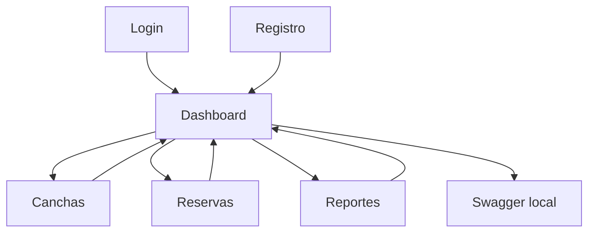
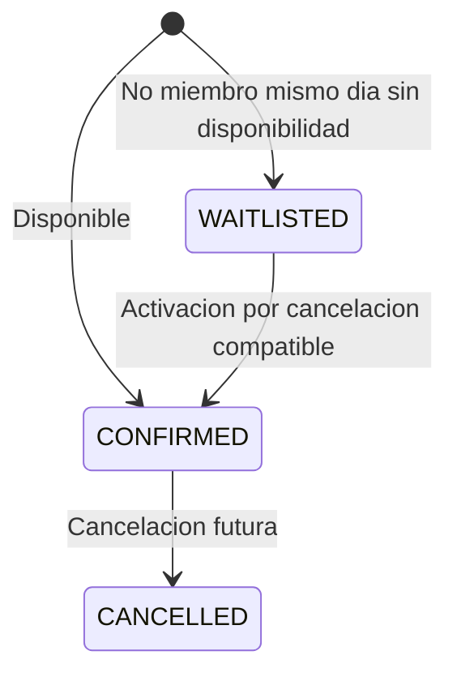
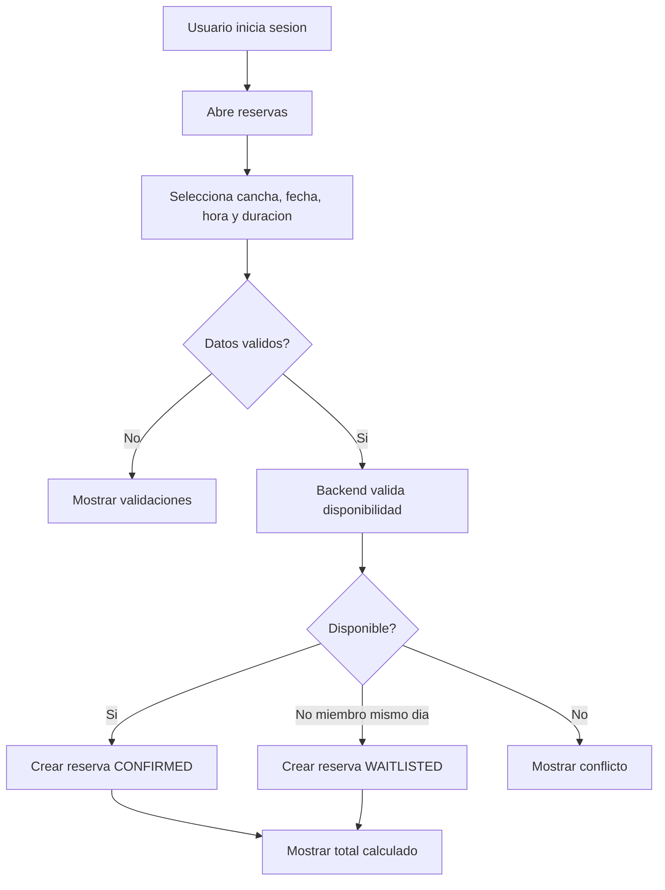

# Documentacion Funcional - Deportal

## 1. Descripcion General del Producto

Deportal es una aplicacion web para administrar la operacion de canchas deportivas. Permite registrar canchas, gestionar reservas, cancelar reservas con reembolso, manejar lista de espera y consultar reportes de utilizacion e ingresos.

Publico objetivo:

| Perfil | Necesidad |
|---|---|
| Administrador deportivo | Gestionar canchas, reservas y reportes |
| Cliente miembro | Crear reservas con beneficios de descuento |
| Cliente no miembro | Crear reservas y entrar en waitlist bajo reglas definidas |
| Evaluador tecnico | Validar reglas de negocio, seguridad y arquitectura |

Metodos de acceso:

| Canal | Descripcion |
|---|---|
| Web | Angular SPA en `http://localhost:4200` |
| API | REST Spring Boot en `http://localhost:8080/api` |
| Swagger | Documentacion interactiva en `/swagger-ui.html` |

Caracteristicas principales:

- Registro y login con JWT.
- Dashboard autenticado.
- Gestion de canchas deportivas.
- Creacion de reservas con validacion de disponibilidad.
- Calculo de descuentos y total de pago.
- Cancelacion con calculo de reembolso.
- Waitlist para no miembros en reservas del mismo dia.
- Reporte de utilizacion e ingresos por cancha.

---

## 2. Navegacion y Estructura de la Interfaz

La aplicacion usa rutas hash para facilitar despliegue estatico futuro. El usuario inicia en login/registro, accede al dashboard y desde alli navega a los modulos operativos.

Rutas principales:

| Ruta | Modulo | Protegida |
|---|---|---|
| `/#/login` | Inicio de sesion | No |
| `/#/register` | Registro de usuario | No |
| `/#/dashboard` | Panel principal | Si |
| `/#/courts` | Canchas | Si |
| `/#/reservations` | Reservas y cancelaciones | Si |
| `/#/reports` | Reportes | Si |

---

## 3. Modulos Principales

### 3.1 Autenticacion

Proposito: permitir que usuarios ingresen al sistema y consuman endpoints protegidos.

Funcionalidades:

| Funcion | Descripcion |
|---|---|
| Registro | Crea usuario y retorna token JWT |
| Login | Valida credenciales y retorna token JWT |
| Logout | Limpia sesion local en frontend |
| Usuario actual | Consulta datos de sesion autenticada |

Campos importantes:

| Campo | Validacion |
|---|---|
| Nombre | Obligatorio en registro |
| Email | Obligatorio, unico |
| Password | Obligatorio |
| Tipo cliente | `MIEMBRO` o `NO_MIEMBRO` |

Reglas:

- Email duplicado no se permite.
- Password se almacena hasheado con BCrypt.
- Token JWT expira en 8 horas.
- Endpoints protegidos requieren `Authorization: Bearer <token>`.

### 3.2 Canchas

Proposito: registrar y consultar canchas deportivas disponibles para reserva.

Campos:

| Campo | Regla |
|---|---|
| Nombre | Obligatorio, unico, maximo 120 caracteres |
| Tipo deporte | `FUTBOL`, `BASQUET`, `TENIS`, `VOLEIBOL`, `MULTIUSOS` |
| Capacidad | Entre 1 y 50 |
| Apertura | Obligatoria |
| Cierre | Obligatoria, posterior a apertura |
| Tarifa por hora | Mayor o igual a 5.00 |

Reglas:

- El horario debe estar dentro del rango global 06:00 a 22:00.
- No se permiten nombres duplicados ignorando mayusculas/minusculas.

### 3.3 Reservas

Proposito: crear reservas para una cancha en un rango horario especifico.

Campos:

| Campo | Regla |
|---|---|
| Usuario | Obligatorio |
| Cancha | Obligatoria |
| Fecha | No puede estar en el pasado |
| Hora inicio | Obligatoria |
| Duracion | Entre 1 y 8 horas |
| Tipo cliente | `MIEMBRO` o `NO_MIEMBRO` |

Reglas:

- La reserva debe estar dentro del horario global 06:00 a 22:00.
- La reserva debe estar dentro del horario de la cancha.
- No puede solaparse con otra reserva confirmada.
- Se exige 1 hora de limpieza antes/despues de reservas confirmadas.
- Clientes no miembros pueden entrar en waitlist si intentan reservar el mismo dia sin disponibilidad.

Estados:

### 3.4 Pagos y Descuentos

Proposito: calcular montos de reserva en el backend.

Reglas:

| Regla | Valor |
|---|---:|
| Descuento miembro | 10% |
| Descuento off-peak | 20% antes de 10:00 o despues de 19:00 |
| Descuento maximo efectivo | 30% |

### 3.5 Cancelaciones y Reembolsos

Proposito: permitir cancelar reservas futuras y calcular reembolso.

Reglas:

| Anticipacion | Reembolso |
|---|---:|
| Mas de 24 horas | 100% |
| Entre 2 y 24 horas | 50% |
| Menos de 2 horas | 0% |

Restricciones:

- No se cancelan reservas pasadas.
- No se cancela una reserva ya cancelada.
- Al cancelar, se intenta activar una waitlist compatible.

### 3.6 Reportes

Proposito: mostrar utilizacion e ingresos por cancha en un rango de fechas.

Filtros:

| Filtro | Regla |
|---|---|
| Desde | Obligatorio |
| Hasta | Obligatorio, no anterior a Desde |

Metricas:

- Reservas totales.
- Horas reservadas.
- Horas disponibles.
- Ingresos.
- Ocupacion.

---

## 4. Configuracion y Administracion

Configuraciones actuales:

| Configuracion | Ubicacion |
|---|---|
| URL API frontend | `public/assets/config/app-config.json` |
| CORS backend | `app.cors.allowed-origins` |
| JWT expiration | `app.jwt.expiration-ms` |
| H2 datasource | `spring.datasource.url` |

Roles disponibles:

| Rol | Descripcion |
|---|---|
| `ADMIN` | Usuario administrativo inicial |
| `USER` | Usuario registrado por frontend |

---

## 5. Reportes y Dashboards

Dashboard:

- Muestra sesion activa.
- Acceso a canchas, reservas y reportes.
- Acceso a Swagger local.

Reporte de utilizacion:

| Columna | Descripcion |
|---|---|
| Cancha | Nombre de cancha |
| Reservas | Numero de reservas confirmadas |
| Horas reservadas | Suma de duraciones |
| Horas disponibles | Horario operativo en rango |
| Ingresos | Total de reservas confirmadas |
| Ocupacion | Horas reservadas / horas disponibles |

---

## 6. Integraciones

No hay integraciones externas obligatorias. La aplicacion integra internamente:

| Integracion | Entrada | Salida |
|---|---|---|
| Angular -> Spring Boot | Requests HTTP JSON | Responses JSON |
| Spring Boot -> H2 | Entidades JPA | Datos persistidos |
| Swagger -> Spring Boot | Requests manuales | Documentacion y respuestas API |

---

## 7. Flujos de Trabajo

Flujo principal de reserva:

---

## 8. Roles y Permisos

| Modulo | ADMIN | USER |
|---|---:|---:|
| Login/Registro | Si | Si |
| Dashboard | Si | Si |
| Consultar canchas | Si | Si |
| Crear canchas | Si | Si, version actual |
| Crear reservas | Si | Si |
| Cancelar reservas | Si | Si |
| Ver reportes | Si | Si, version actual |
| Swagger | Si | Si, si conoce credenciales/token |

> Recomendacion futura: restringir creacion de canchas y reportes a `ADMIN` con autorizacion por rol.
