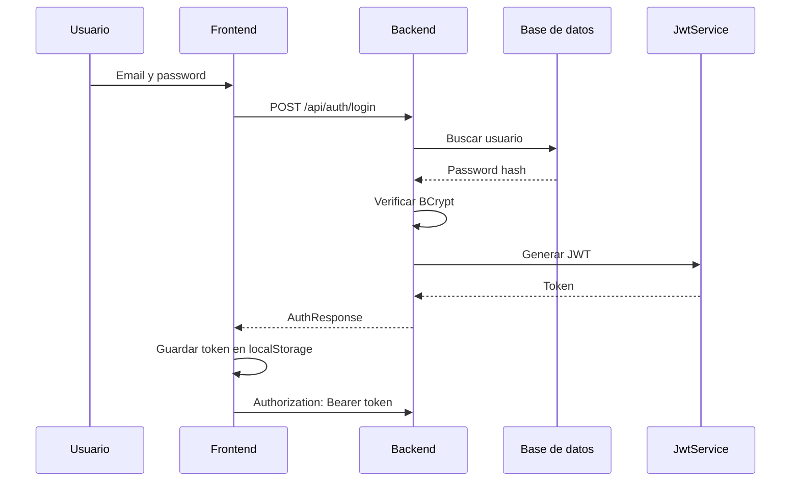
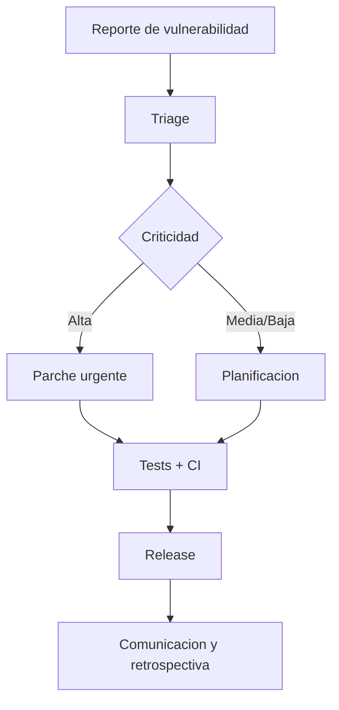

# Documentacion de Seguridad - Deportal

## 1. Postura de Seguridad General

Deportal sigue una postura de seguridad pragmatica para una prueba tecnica local: autenticacion obligatoria para endpoints de negocio, contrasenas hasheadas, JWT sin cookies, validaciones en backend y configuracion portable por variables de entorno.

Principios:

| Principio | Aplicacion |
|---|---|
| Security by Design | Seguridad integrada desde auth, DTOs y validaciones |
| Least Privilege | Preparado para roles `ADMIN` y `USER` |
| Stateless API | JWT Bearer sin sesion servidor |
| No secretos reales en codigo | Defaults solo para entorno local/demo |

Cumplimiento normativo:

- No se declara cumplimiento GDPR, HIPAA, PCI-DSS o SOC2.
- La aplicacion no procesa pagos reales ni datos altamente sensibles.
- Para produccion se requiere evaluacion formal de privacidad y retencion de datos.

## 2. Autenticacion y Control de Acceso

### 2.1 Autenticacion

| Mecanismo | Estado |
|---|---|
| Registro local | Implementado |
| Login local | Implementado |
| JWT Bearer | Implementado |
| OAuth2/SAML | No implementado |
| MFA | No implementado |

Flujo de login:

### 2.2 Sesiones

| Control | Implementacion |
|---|---|
| Duracion token | 8 horas |
| Transporte | Header `Authorization` |
| Cookies | No usadas |
| Logout | Limpieza local del token |
| Refresh token | No implementado |

### 2.3 Matriz de acceso

| Recurso | Publico | Autenticado |
|---|---:|---:|
| `POST /api/auth/register` | Si | Si |
| `POST /api/auth/login` | Si | Si |
| `GET /api/health` | Si | Si |
| Swagger UI | Si | Si |
| H2 Console local | Si en local | Si en local |
| `/api/courts/**` | No | Si |
| `/api/reservations/**` | No | Si |
| `/api/reports/**` | No | Si |
| `/api/auth/me` | No | Si |

> Recomendacion futura: aplicar autorizacion por rol para limitar creacion de canchas y acceso a reportes a `ADMIN`.

## 3. Proteccion de Datos

| Categoria | Estado actual | Recomendacion produccion |
|---|---|---|
| En transito | HTTP local | TLS 1.2/1.3 obligatorio |
| En reposo | H2 archivo local | RDS con cifrado KMS |
| Passwords | BCrypt | Mantener BCrypt/Argon2 con politica formal |
| Backups | No configurados | Backups automatizados y pruebas de restore |
| PII | Nombre/email cliente | Politica de retencion y minimizacion |

## 4. Seguridad en la Aplicacion

### 4.1 Validacion de entradas

- Backend usa DTOs con `jakarta.validation`.
- Jackson rechaza campos desconocidos.
- Hay sanitizacion basica de strings.
- Reglas de negocio se validan en servicios, no solo en frontend.

### 4.2 OWASP Top 10

| Riesgo | Control actual |
|---|---|
| Broken Access Control | Endpoints protegidos con Spring Security |
| Cryptographic Failures | BCrypt para passwords; JWT firmado |
| Injection | JPA repositories y queries parametrizadas |
| Insecure Design | Reglas centralizadas en backend |
| Security Misconfiguration | Swagger/H2 habilitados solo para local/demo |
| Vulnerable Components | Dependencias gestionadas por Maven/npm y CI |
| Auth Failures | Password hashing y token expiration |
| Data Integrity | Validaciones backend antes de persistir |
| Logging/Monitoring | Basico Spring; pendiente observabilidad productiva |
| SSRF | No hay consumo de URLs externas |

### 4.3 Headers y errores

| Control | Estado |
|---|---|
| X-Frame-Options | `sameOrigin` para H2 Console local |
| CORS | Configurable por `app.cors.allowed-origins` |
| CSRF | Deshabilitado por API stateless sin cookies |
| Stack traces | No expuestos por `GlobalExceptionHandler` |

## 5. Infraestructura y Red

Local:

- Frontend en `localhost:4200`.
- Backend en `localhost:8080`.
- H2 dentro del proceso/backend container.

Produccion recomendada:

| Capa | Recomendacion |
|---|---|
| Frontend | S3 + CloudFront + HTTPS |
| Backend | ECS/EC2 detras de ALB |
| DB | RDS PostgreSQL privado |
| Red | VPC, subnets privadas, security groups minimos |
| Perimetro | WAF y rate limiting |

## 6. Gestion de Secretos

Politica:

- No subir secretos reales al repositorio.
- No usar JWT secrets demo en produccion.
- Usar variables de entorno en local/demo.
- Usar GitHub Secrets en CI si se agregan credenciales externas.
- Usar AWS Secrets Manager o Vault en produccion.

Variables sensibles:

| Variable | Uso | Estado |
|---|---|---|
| `JWT_SECRET` | Firma JWT | Default local/demo |
| `SPRING_DATASOURCE_PASSWORD` | Password DB | Vacio para H2 local |
| `APP_CORS_ALLOWED_ORIGINS` | Origenes permitidos | Configurable |

## 7. SDLC Seguro

Controles actuales:

| Control | Backend | Frontend |
|---|---:|---:|
| Tests CI | Si | Si |
| Build CI | Docker build | Angular build |
| Smoke test | `/api/health` | No aplica |
| SAST | Pendiente | Pendiente |
| SCA | Pendiente | Pendiente |

Recomendaciones:

- Agregar Dependabot para Maven/npm.
- Agregar CodeQL para Java/TypeScript.
- Agregar Trivy o Grype para imagen Docker.
- Bloquear merge si CI falla.

## 8. Respuesta a Incidentes

Proceso recomendado:

Politica sugerida:

| Paso | Responsable | SLA sugerido |
|---|---|---|
| Confirmar recepcion | Equipo tecnico | 1 dia habil |
| Clasificar severidad | Tech Lead / Security | 2 dias habiles |
| Mitigar criticos | Equipo backend/frontend | 24-72 horas |
| Documentar RCA | Equipo tecnico | 5 dias habiles |

Contacto de seguridad: `[Pendiente: Definir correo/canal de seguridad]`.
