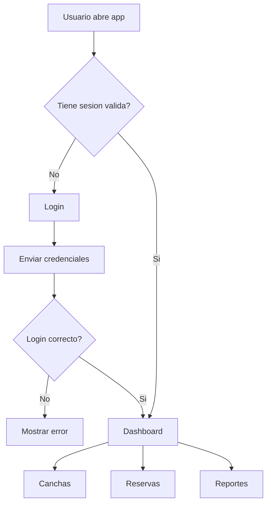
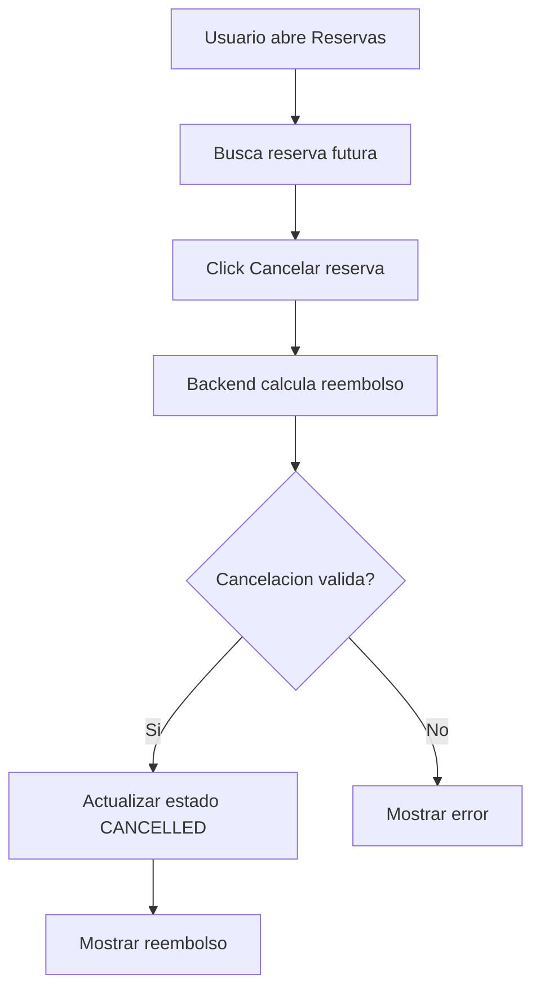

# Guia UX/UI - Deportal

## 1. Principios de Diseno

Filosofia visual:

- Interfaz administrativa moderna, limpia y de alta legibilidad.
- Uso de cards amplias, sombras suaves, bordes redondeados y colores diferenciados por modulo.
- Enfoque desktop-first con adaptacion responsiva a mobile.

Principios de experiencia:

| Principio | Aplicacion |
|---|---|
| Claridad sobre densidad | Formularios cortos y mensajes visibles |
| Accion directa | Botones principales cercanos al contexto |
| Feedback inmediato | Estados `Cargando`, `Creando`, `Cancelando` |
| Errores accionables | Mensajes de validacion especificos |
| Continuidad operativa | Los listados se actualizan tras crear/cancelar |

Accesibilidad objetivo:

- WCAG 2.1 AA como referencia.
- Contraste alto en textos principales.
- Estados `focus` visibles en inputs.
- Formularios con labels asociados visualmente.
- Navegacion por rutas claras.

## 2. Sistema de Diseno

### 2.1 Color

Paleta base:

| Token | HEX | Uso |
|---|---|---|
| `--color-slate-950` | `#0f172a` | Paneles oscuros, texto fuerte |
| `--color-teal-700` | `#0f766e` | Acciones principales dashboard/canchas |
| `--color-teal-300` | `#5eead4` | Titulos en panel oscuro |
| `--color-orange-600` | `#ea580c` | Reservas |
| `--color-indigo-600` | `#4f46e5` | Reportes |
| `--color-red-700` | `#b91c1c` | Errores |
| `--color-green-300` | `#86efac` | Reembolso/exito oscuro |
| `--color-white` | `#ffffff` | Cards y formularios |

Variables sugeridas:

```scss
:root {
  --color-bg: #f8fafc;
  --color-text: #0f172a;
  --color-primary: #0f766e;
  --color-reservations: #ea580c;
  --color-reports: #4f46e5;
  --color-error: #b91c1c;
  --color-success-bg: #ccfbf1;
  --radius-card: 1.5rem;
  --shadow-card: 0 22px 60px rgba(15, 23, 42, 0.09);
}
```

Modo actual:

- La aplicacion usa modo claro con paneles oscuros puntuales.
- No existe toggle dark mode.

### 2.2 Tipografia

Fuente base:

```scss
font-family: Inter, ui-sans-serif, system-ui, -apple-system, BlinkMacSystemFont, "Segoe UI", sans-serif;
```

Escala sugerida:

| Elemento | Tamano | Peso | Line-height |
|---|---:|---:|---:|
| H1 | `clamp(2.4rem, 7vw, 5rem)` | 800-900 | 0.92-0.95 |
| H2 | `1.5rem` | 800 | 1.2 |
| H3 | `1rem-1.18rem` | 800 | 1.3 |
| Body | `1rem` | 400-500 | 1.7 |
| Small/label | `0.78rem-0.88rem` | 700-900 | 1.4 |

### 2.3 Iconografia

No se usa libreria de iconos. El sistema usa:

- Check visual mediante pseudo-elementos CSS.
- Flecha de regreso como texto `← Dashboard`.
- Estados mediante badges y color.

Regla futura:

- Si se agregan iconos, usar SVG inline o una libreria ligera.
- Tamanos recomendados: 16px, 20px, 24px.

### 2.4 Espaciado y Layout

Escala:

| Token | Valor |
|---|---:|
| `xs` | 0.35rem |
| `sm` | 0.5rem |
| `md` | 0.85rem |
| `lg` | 1rem |
| `xl` | 1.25rem |
| `2xl` | 2rem |
| `3xl` | 3rem |

Breakpoints observados:

| Breakpoint | Uso |
|---|---|
| `760px` | Dashboard/auth pasa a una columna |
| `840px` | Canchas pasa a una columna |
| `880px` | Reservas pasa a una columna |
| `900px` | Reportes pasa a una columna |

## 3. Componentes UI Core

### Botones

| Variante | Uso | Color |
|---|---|---|
| Primary | Accion principal | Teal/Naranja/Indigo segun modulo |
| Secondary/Ghost | Accion alternativa | Blanco con borde gris |
| Danger | Cancelar reserva | Fondo rojo claro, texto rojo |
| Disabled | Operacion en curso | Opacidad reducida |

Estados:

| Estado | Comportamiento |
|---|---|
| Default | Color solido, borde redondeado |
| Hover | `[Pendiente: definir animacion hover global]` |
| Focus | Debe mantener outline visible |
| Disabled | `cursor: not-allowed`, opacidad `0.68` |

### Inputs

Tipos usados:

- Text.
- Email.
- Password.
- Number.
- Time.
- Date.
- Select.

Reglas:

- Label visible arriba del input.
- Error debajo del campo.
- `focus` con outline de color del modulo.
- Inputs de fecha/hora usan controles nativos.

### Cards y Contenedores

| Componente | Uso |
|---|---|
| Hero card | Dashboard y auth |
| Form card | Canchas/reservas/reportes |
| List card | Listados de canchas/reservas |
| Summary card | KPIs de reportes |

### Modales y Drawers

No implementados en la version actual. Recomendacion futura:

- Usar modales solo para confirmaciones destructivas.
- Confirmacion de cancelacion de reserva seria buen candidato.

### Alertas y Toasts

Actualmente se usan mensajes inline:

| Tipo | Estilo |
|---|---|
| Error | Fondo rojo claro, texto rojo |
| Success | Fondo verde/naranja claro segun modulo |

### Tablas y Listas

- Reportes usa tabla responsiva con scroll horizontal.
- Canchas y reservas usan cards adaptativas.
- Estados vacios se muestran con cards punteadas.

## 4. Patrones de Interaccion

### Navegacion

- Dashboard como hub operativo.
- Cada modulo tiene link de retorno a Dashboard.
- Hash routing para compatibilidad con hosting estatico.

### Feedback

| Accion | Feedback |
|---|---|
| Login | Boton `Ingresando...` |
| Registro | Boton `Registrando...` |
| Crear cancha | Boton `Registrando...` + mensaje exito |
| Crear reserva | Boton `Creando...` + mensaje exito |
| Cancelar reserva | Boton `Cancelando...` + reembolso |
| Generar reporte | Boton `Generando...` |

### Errores

- Validacion cliente antes de enviar request.
- Mensajes backend mostrados cuando hay `message` o `validationErrors`.
- Rango de fechas invalido se bloquea en frontend.

### Micro-interacciones

No hay animaciones complejas. Recomendacion futura:

- Transicion suave en cards al hover.
- Skeletons para listados.
- Toasts para operaciones completadas.

## 5. Flujos de Usuario

Login y navegacion principal:



Cancelacion de reserva:



## 6. Contenido y Tono

Voz del producto:

- Clara.
- Operativa.
- Profesional.
- Directa.

Reglas UX writing:

| Caso | Recomendacion |
|---|---|
| Botones | Verbo + objeto: `Crear reserva`, `Registrar cancha` |
| Errores | Explicar que corregir: `La fecha no puede estar en el pasado` |
| Exito | Confirmar resultado: `Cancha registrada correctamente` |
| Carga | Usar gerundio: `Cargando`, `Creando`, `Cancelando` |

Evitar:

- Mensajes tecnicos crudos.
- Stack traces.
- Codigos internos sin explicacion.
- Referencias a etapas de desarrollo en la UI final.
